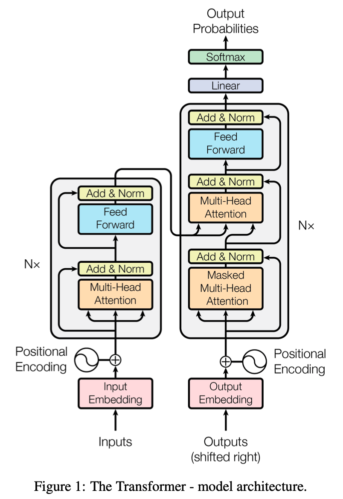

## Abstract
The dominant sequence transduction models are based on complex recurrent or convolutional neural
networks that include an encoder and a decoder. The best performing models also connect the 
encoder and decoder through an attention mechanism. The authors proposed a new simple network
architecture, the Transformer, based soly on attention mechanisms, dispensing with recurrence
and convolutions entirely. 

## 1 Introduction
Recurrent neural networks, long short-term memory and gated recurrent neural networks in
particular, have been firmly established as state of the art approaches in sequence modeling 
and transduction problems such as language modeling and machine translation. Numerous efforts
have since continued to push the boundaries of recurrent language models and encoder-decoder
architectures.

Recurrent models typically factor computation along the symbol positions of the input and 
output sequences. Aligning the positions to steps in computation time, they generate a sequence
of hidden states h_t, as a function of the previous hidden state h_t-1 and the input position t.
This inherently sequential nature precludes parallelization within training examples, which becomes
critical at longer sequence lengths, as memory constraints limit batching across examples. 

Attention mechanisms have become an integral part of compelling sequence modeling and transduction
models in various tasks, allowing modeling of dependencies without regard to their distance in the
input or output sequences.

In this work, the authors propose the Transformer, a model architecture eschewing recurrence and 
instead relying entirely on an attention mechanisom to draw global dependencies between input and
output. The Transformer allows for significantly more parallelization and can reach a new state 
of the art in translation quality after being trained for as twelve hours on eight P100 GPUs.

## 2 Background
The goal of reducing sequential computation also forms the foundation of the Extended Neural GPU,
ByteNet and ConvS2S, all of which use convolutional neural networks as basic building block, 
computing hidden representations in parallel for all input and output positions.

Self-attention, sometimes called intra-attention is an attention mechanisom relating differnt 
positions of a single sequence in order to compute a representation of the sequence. Self-attention
has been used successfully in a variety of tasks including reading comprehension, abstractive 
summarization, textural entailment and learning task-independent sentence representations.

Transformer is the first transduction model relying entirely on self-attention to compute representations
of its input and output using sequence aligned RNNs or convolution.

## 3 Model Architecture

### 3.1 Encoder and Decoder Stacks
**Encoder:** The encoder is composed of a stack of N = 6 identical layers. Each layer has two 
sub-layers. The first is a multi-head self-attention mechanism, and the second is a simple, 
position-wise fully connection feed-forward netwrk. We employ a residual connection around each
of the two sub-layers, followed by layer normalization. That is, the output of each sub-layer is 
LayerNorm(x+Sublayer(x)), where Sublayer(x) is the function implemented by the sub-layer itself.
To facilitate these residual connections, all sub-layers in the model, as well as the embedding
layers, produce outputs of dimension d_model = 512.

**Decoder**: The decoder is also composed of a stack of N = 6 identical layers.

### 3.2 Attention
An attention function can be described as mapping a query and a set of key-value pairs to an output,
where the query, keys, values and output are all vectors.